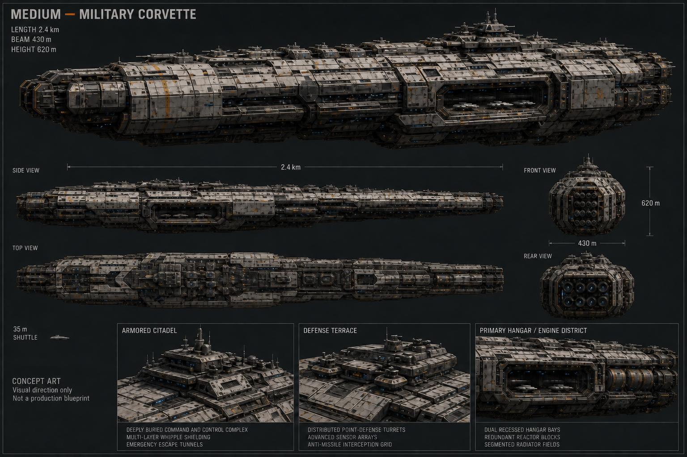
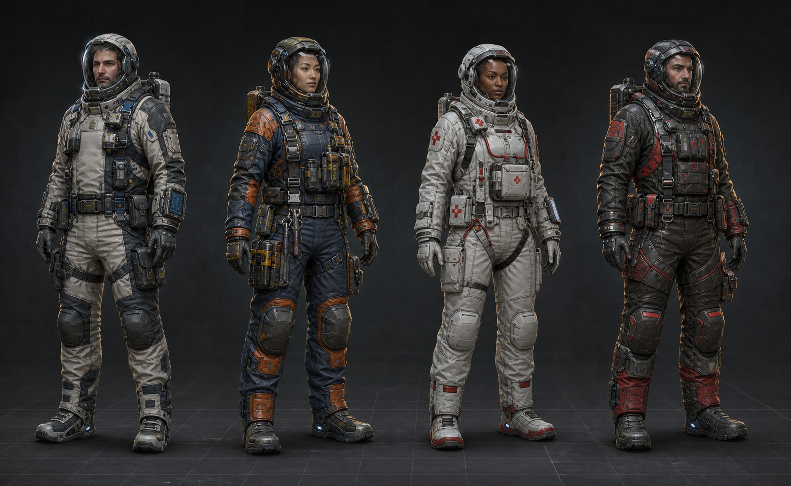
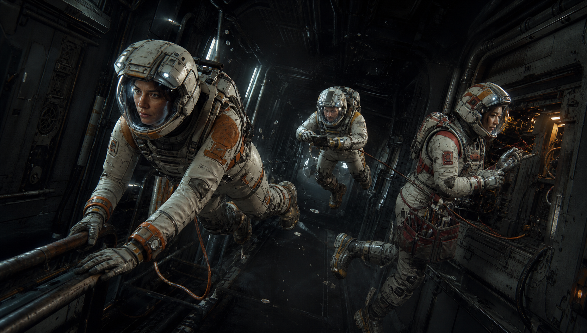
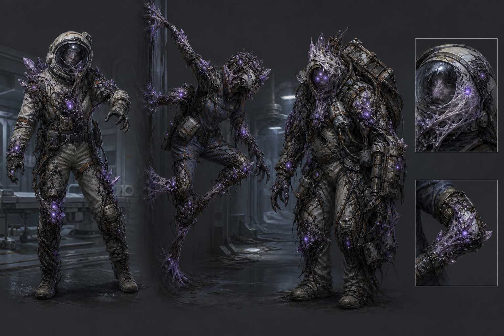
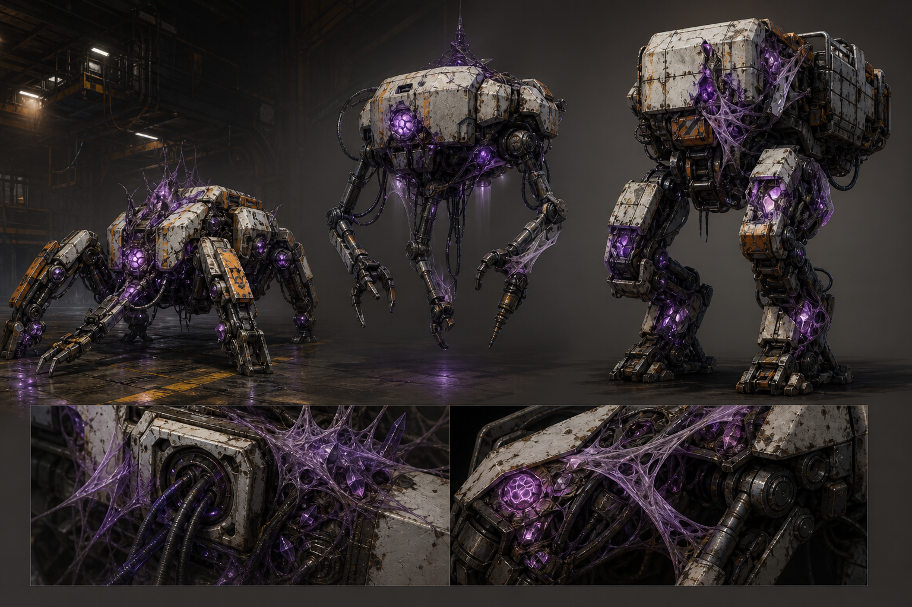
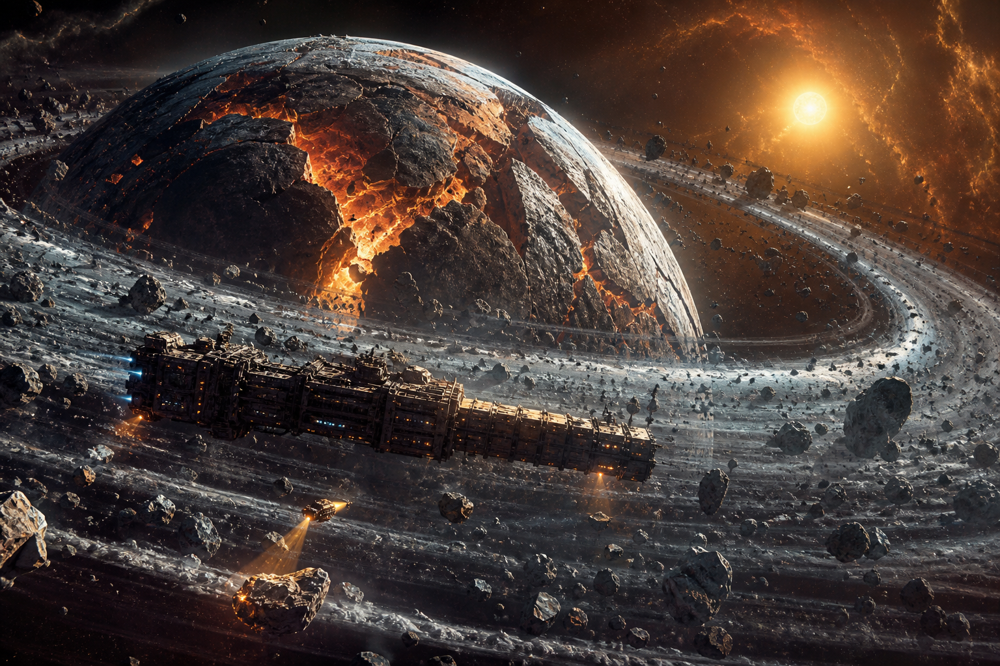
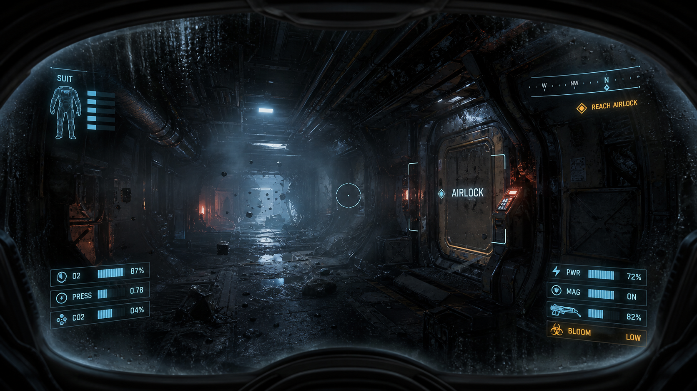
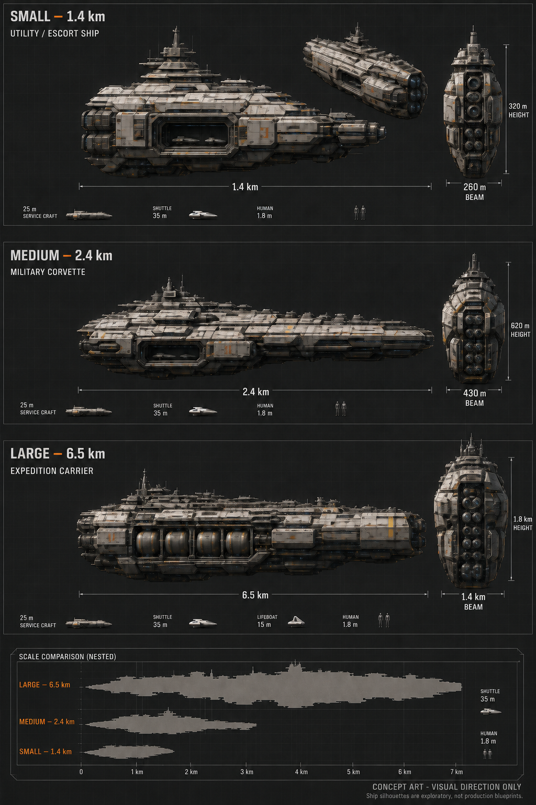
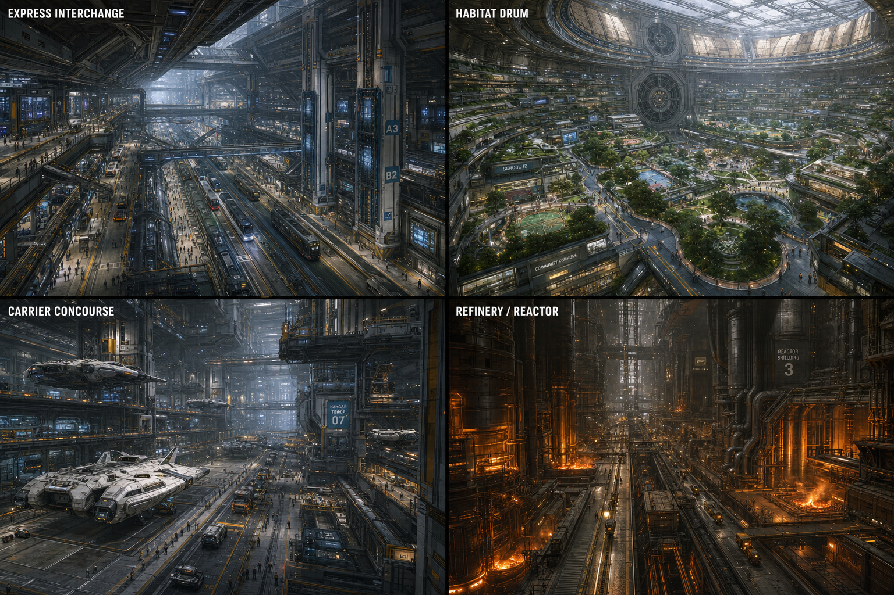
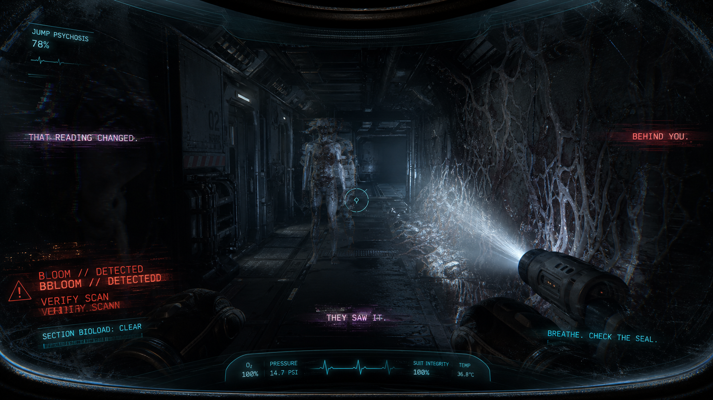

# Ginnungagap concept gallery

These ten selected images describe visual intent. They are AI-assisted concept work, not gameplay captures or final production assets. Selection does not change the current game architecture.

## A · Corvette exterior

**Concept art.** Current-slice subject; exploratory ship silhouette. Corrected publication copy removes the obsolete Small comparator. The exterior does not define the current thrust-axis architecture.

**Provenance:** AI-assisted concept visualization; exact original model and editing history are not fully verified. Publication correction generated with OpenAI image editing on 2026-09-08; renewed visual review required.

## D · Crew role lineup

**Concept art.** Planned crew specialization. The current solo slice follows an Engineer; this lineup does not establish implemented co-op roles or final suits.

**Provenance:** AI-assisted concept visualization; exact original model and editing history are not fully verified. Original selected image copied unchanged.

## F · Zero-gravity maintenance

**Concept art.** Physical maintenance and suit vulnerability. This is visual intent for a core slice activity, not a captured gameplay frame.

**Provenance:** AI-assisted concept visualization; exact original model and editing history are not fully verified. Original selected image copied unchanged.

## H · Reanimated crew

**Concept art.** Exploration of the Bloom altering familiar human forms. The current slice targets one stalker; these variants are not a promised playable roster.

**Provenance:** AI-assisted concept visualization; exact original model and editing history are not fully verified. Original selected image copied unchanged.

## I · Infested drones and robots

**Concept art.** Planned threat variety: industrial machines overtaken by the Bloom. These enemy forms are outside the current solo acceptance scope.

**Provenance:** AI-assisted concept visualization; exact original model and editing history are not fully verified. Original selected image copied unchanged.

## K · Fractured ring world

**Concept art.** Exploration of scale, isolation and the unknown beyond the ship. This environment is a future visual possibility, not an implemented or committed destination.

**Provenance:** AI-assisted concept visualization; exact original model and editing history are not fully verified. Original selected image copied unchanged.

## O · In-helmet HUD

**Concept art.** Exploratory helmet framing and survival telemetry. Interface styling and shown values are concept work, not evidence of the current playable HUD.

**Provenance:** AI-assisted concept visualization; exact original model and editing history are not fully verified. Original selected image copied unchanged.

## R · Fleet scale comparison

**Concept art.** Planned Utility Escort, Corvette and Expedition Carrier. Corrected labels use current design envelopes; speculative crew, deck and performance statistics are removed. Silhouettes remain exploratory, not construction authority.

**Provenance:** AI-assisted concept visualization; exact original model and editing history are not fully verified. Publication correction generated with OpenAI image editing on 2026-09-08; renewed visual review required.

## V · Expedition carrier interiors

**Concept art.** Future large-ship atmosphere and interior variety. The carrier is planned expansion, beyond the current Corvette slice.

**Provenance:** AI-assisted concept visualization; exact original model and editing history are not fully verified. Original selected image copied unchanged.

## X · Jump psychosis

**Concept art.** Visual exploration of altered perception and the danger of an unprotected jump. This image does not demonstrate a finished gameplay effect.

**Provenance:** AI-assisted concept visualization; exact original model and editing history are not fully verified. Original selected image copied unchanged.

[Return to the project](README.md) · [Rights and credits](RIGHTS-AND-CREDITS.md)
