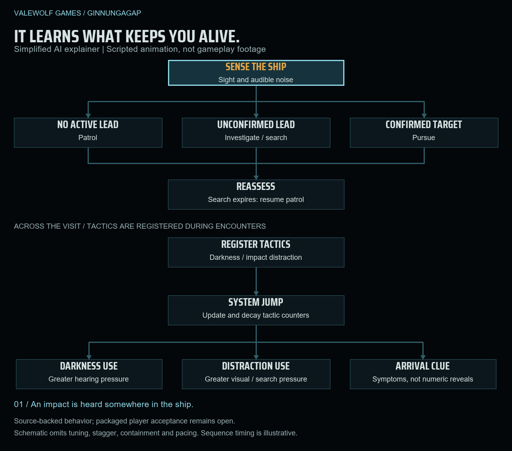

# GINNUNGAGAP

## You will never see the whole picture. It will.

**First-person industrial sci-fi survival horror · Windows · In development at Valewolf Games**

*Concept art. Exploration of scale, isolation and the unknown beyond the ship. This environment is a future visual possibility, not an implemented or committed destination.*

## The ship is failing. You still need it.

You are the Engineer aboard a damaged interstellar ship. Power is unstable. The atmosphere is compromised. Somewhere in the compartments you need to reach, the Bloom is learning how you survive.

Reach the machinery. Diagnose the fault. Finish the repair while listening for movement beyond the door. The quieter route may cost you more oxygen. The tool that fixes the problem may give you away.

[Explore the pitch](documents/Ginnungagap-Public-Pitch.pdf) · [Read the project overview](documents/Ginnungagap-Project-Overview.pdf) · [Open the concept gallery](GALLERY.md) · [Demo video status](Demo%20video/README.md)

## Every repair exposes you.

Keeping the ship alive means going where the work is. Restore power, cross zero-gravity spaces and patch consequential damage. Oxygen, suit integrity, tool charge and time turn maintenance into a survival decision.

*Concept art. Physical maintenance and suit vulnerability. This is visual intent for a core slice activity, not a captured gameplay frame.*

## It learns what keeps you alive.

Hide in darkness. Draw it away with noise. Trap it behind a door. Ginnungagap is built around the tension of using ship systems against a threat designed to adapt to the tactics you repeat. The solo slice focuses on evading and containing one Bloom stalker.

*Concept art. Exploration of the Bloom altering familiar human forms. The current slice targets one stalker; these variants are not a promised playable roster.*

## Bloom decision preview

*An explanatory animation based on current AI code, not gameplay footage or live telemetry. It shows how the stalker reacts to sight and sound, then how tactics influence pressure after a jump. Timing is illustrative; packaged player acceptance remains open.*

[Download the interactive preview](media/bloom-decisions.html) to select encounters and use play, pause or step controls. On GitHub, download the HTML file and open it in a browser. [View a still diagram](art/bloom-decisions.png) if you prefer no animation.

## Every jump is a deadline.

The sensors can only tell you so much. Choose a destination, commit, then get back to cryo before departure. The next awakening is meant to reveal what changed while you were under. Escape does not mean you left it behind.

*Concept art. Exploratory helmet framing and survival telemetry. Interface styling and shown values are concept work, not evidence of the current playable HUD.*

## The first journey

A first playable exists. We are working toward an accepted **30 to 45 minute solo Corvette slice**, connecting Cryo, Suit and Workshop, Power, Damage Control, Maintenance and CIC. The duration is a target; full player and presentation acceptance remain open.

The milestones ahead are to finish that journey, polish an exact publisher build, prove the loop with two players and release a public demo. The wider vision expands toward one-to-four-player expeditions across Utility Escort, Corvette and Expedition Carrier classes. **Co-op, additional ships and broader environments are planned scope.** No release dates are announced.

The gallery images are **AI-assisted concept art**, not gameplay captures or final production assets. The Bloom diagram is a code-based explanatory graphic. The gallery identifies each image's visual intent, scope and provenance.

## Help us bring the next jump to life.

Ginnungagap is created by solo developer **James Shattuck** at **Valewolf Games**, the games studio of **Skald and Stone LLC**. We are seeking development partners for the first complete slice and the cooperative expeditions beyond it.

[james@skaldandstone.com](mailto:james@skaldandstone.com) · [Project webpage](https://skaldandstone.com/valewolf/ginnungagap/) · [Rights and credits](RIGHTS-AND-CREDITS.md)

Playable reviewer access is distributed privately after exact-build acceptance.
