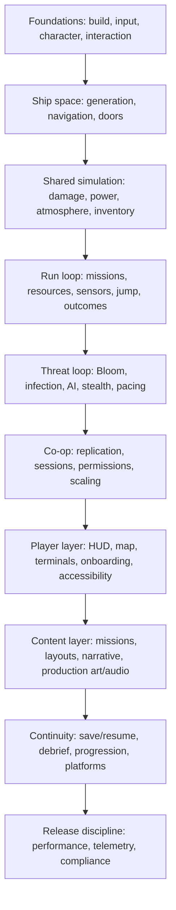

# Ginnungagap Module Storyboard

**Status:** Living production storyboard  
**Coverage date:** 2026-08-05 (module statuses not fully re-audited since; M03 was spot-corrected
2026-08-24 - see its status line)  
**Scope:** Originally all 85 Linear issues in the Ginnungagap project; the project now has 92
(TRO-215–217 added 2026-08-24) not yet reflected below, plus the gameplay modules currently
represented in `Source/Ginnungagap`.

## 1. How to read this document

This is a gameplay storyboard, not a screenplay. Each module is described as a short sequence of observable player beats that can be turned into a greybox test, UI flow, trailer shot, or implementation acceptance test.

Status terms:

- **Created:** A meaningful C++ foundation exists.
- **Active:** The current implementation slice is in progress.
- **Planned:** The module exists as tracked design or implementation work but does not yet have a production implementation.
- **Mixed:** Some foundations exist, but connected content, UI, networking, or validation remains planned.

Every module includes the same six lenses:

1. **Intent** - what the player should understand or feel.
2. **Storyboard** - the observable sequence from setup through consequence.
3. **Presentation** - information, sound, animation, and environmental feedback.
4. **Failure and recovery** - how the system creates pressure without becoming opaque.
5. **Dependencies** - other modules needed to complete the experience.
6. **Proof** - the minimum playable evidence required to call the module complete.

## 2. Whole-game player journey

```mermaid
flowchart LR
    A["Launch and profile"] --> B["Choose mode, crew, class, and loadout"]
    B --> C["Board generated ship and receive mission"]
    C --> D["Assess system, hazards, damage, and Bloom clues"]
    D --> E["Explore, gather, rescue, and repair"]
    E --> F["Select uncertain jump destination"]
    F --> G["Warning: reach cryo or accept the risk"]
    G --> H["Jump: fate, sabotage, and hidden Bloom evolution"]
    H --> I["Arrival: reveal consequences and new objectives"]
    I --> D
    I --> J["Final arrival, self-destruct, or crew loss"]
    J --> K["Debrief, rewards, progression, and next run"]
```

The emotional cadence is: **prepare → investigate → improvise → commit → panic → endure → discover**. Quiet operational competence should make the eventual loss of control feel sharper.

## 3. Module storyboards

### M01 - Boot, settings, and accessibility

**Status:** Planned  
**Linear:** TRO-59, TRO-84, TRO-88

**Intent:** The game should establish its grounded terminal language immediately while giving every player a safe, reversible way to configure input, presentation, captions, and accessibility.

**Storyboard:**

1. Publisher/engine marks resolve into a dark ship terminal boot sequence.
2. A first-launch panel requests brightness, subtitle, audio, input, and motion-sensitivity choices.
3. The player previews changes against a representative dark corridor, alarm, radio line, and HUD sample.
4. Settings expose remapping, controller navigation, hold/toggle alternatives, color-independent warnings, and readable text scaling.
5. Apply, revert, and unsaved-change confirmation states are demonstrated.
6. The terminal hands off to profile creation or the start screen with settings persisted.

**Presentation:** Diegetic boot diagnostics, restrained amber/cyan text, hard-edged focus states, captions that identify radio speaker and direction, no information conveyed by color alone.

**Failure and recovery:** Unsupported resolution or mapping changes automatically roll back. All screens remain keyboard, mouse, and gamepad navigable. A reset-to-safe-defaults path is always available.

**Dependencies:** Menu framework, save system, localization, platform services.

**Proof:** Complete the entire flow without a mouse; restart and confirm settings persist; force an invalid display choice and observe rollback.

### M02 - Profile creation and front-end navigation

**Status:** Mixed - C++ foundations created; Widget Blueprints and full-flow validation planned  
**Linear:** TRO-25, TRO-27, TRO-38, TRO-39, TRO-41, TRO-60

**Intent:** Move from identity to play with minimal friction, while making character continuity and mode selection legible.

**Storyboard:**

1. On first launch, the player creates a named crew profile.
2. The start screen offers Continue, New Run, Multiplayer, Progression, Settings, and Quit according to available state.
3. Mode selection explains solo/co-op consequences and current multiplayer support.
4. Map/run customization presents seed, difficulty, ship class, and allowed modifiers without exposing hidden Bloom truth.
5. Multiplayer options transition into hosting, joining, or invite handling.
6. Returning players see their profile, currency, unlocked skills, and suspended-run status before committing.

**Presentation:** Slow camera drift across a dormant vessel; menus appear as practical operations software, with clear back-stack behavior and no dead-end screens.

**Failure and recovery:** Missing/corrupt profiles produce a non-destructive recovery flow. Network failures return to the relevant menu with the attempted configuration intact.

**Dependencies:** Persistence, multiplayer session flow, progression, settings.

**Proof:** Fresh-install, returning-player, corrupt-save, and failed-join paths all return the player to a valid interactive screen.

### M03 - Lobby, crew formation, and co-op governance

**Status:** Mixed (updated 2026-08-24) - replicated crew lobby (`ALobbyGameState`/`ALobbyPlayerState`)
and session matchmaking (`UMultiplayerSessionSubsystem`: host, find/join, leave, reconnect-on-failure
messaging) exist and are wired into the menu flow; roles/loadouts, readiness, pings/orders, and
critical-action governance (storyboard beats 2–6) remain planned  
**Linear:** TRO-52, TRO-53, TRO-54, TRO-73, TRO-75, TRO-86

**Intent:** Make cooperation deliberate and readable while preserving the tension of imperfect communication and emergency improvisation.

**Storyboard:**

1. The host creates a run and chooses privacy, player-count, difficulty, and join policy.
2. Crew members join, select roles/loadouts, inspect readiness, and identify uncovered capabilities.
3. The lobby previews critical-action policy: jump authority, self-destruct, airlocks, quarantine, resource spending, and friendly fire.
4. In play, contextual pings and short orders mark rooms, systems, hazards, objectives, and items.
5. A critical action triggers the configured confirmation, role permission, or vote.
6. Disconnect/reconnect, AFK, kick, and host-loss paths preserve or safely terminate the run.

**Presentation:** Crew roster resembles a duty board; voice and ping indicators remain spatial and low-clutter; irreversible actions use distinct guarded controls.

**Failure and recovery:** A disconnected specialist can be replaced by solo-assist behavior or redistributed permissions. Grief-prone actions are logged, delayed, or reversible where fiction permits.

**Dependencies:** Profiles, loadouts, replication, persistence, communications, solo scaling.

**Proof:** Four-player host/join/reconnect test; one-player continuation after disconnect; every critical action follows the selected governance rule.

### M04 - Onboarding and training

**Status:** Planned  
**Linear:** TRO-78

**Intent:** Teach systems through safe operations that later become dangerous under pressure.

**Storyboard:**

1. Movement, interaction, HUD, signage, and inventory are introduced in a lit maintenance bay.
2. A controlled gravity failure teaches push-off, thrust, braking, and camera orientation.
3. A suit drill teaches oxygen, radiation, temperature, and EVA return discipline.
4. A repair drill introduces scanning, diagnosis, power routing, breaches, fire, and resource costs.
5. A sensor simulation teaches candidate uncertainty and false-readout language.
6. A short jump drill combines countdown, cryo, failure consequences, and post-arrival review.

**Presentation:** Training uses physical checklists, instructor radio, floor markings, and resettable simulators rather than modal text walls.

**Failure and recovery:** Each station resets independently. Contextual reminders escalate only after repeated hesitation, and the full tutorial can be skipped or replayed.

**Dependencies:** Nearly every core gameplay module; accessibility; objective framework.

**Proof:** A new tester completes a jump without external instruction and can correctly explain one sensor uncertainty and one Bloom clue.

### M05 - Player body, movement, camera, and survival state

**Status:** Mixed - replicated character and survival state created; production character and tuning planned  
**Linear:** TRO-6, TRO-7, TRO-8, TRO-9, TRO-30, TRO-34, TRO-36

**Intent:** The player should feel physically vulnerable, readable to teammates, and strongly grounded in the ship until gravity or suit integrity is lost.

**Storyboard:**

1. The player wakes with stable health, oxygen, radiation, suit integrity, and balance.
2. Normal locomotion, camera, interaction, and environmental readouts establish a predictable baseline.
3. A hazard changes one survival value and produces a matching bodily, suit, HUD, and audio response.
4. Multiple hazards combine: low oxygen narrows choices while radiation or instability discourages delay.
5. Gravity loss changes locomotion and camera behavior without discarding learned controls.
6. Recovery restores capability in stages, leaving enough feedback to understand what helped.

**Presentation:** Suit breathing, visor condensation, dosimeter clicks, servo strain, camera roll, posture, and teammate animation all reinforce state.

**Failure and recovery:** Warning bands precede incapacitation. Inputs remain responsive under impairment; effects should pressure judgment rather than create unexplained control loss.

**Dependencies:** Hazards, equipment, medical, HUD, animation, audio, zero-g.

**Proof:** PIE test every survival threshold, transition between gravity states, death/respawn, and replicated teammate observation.

### M06 - Interaction, focus, and physical affordances

**Status:** Created foundation; production assets and usability pass remain  
**Linear:** TRO-11, TRO-42

**Intent:** Players should recognize what can be touched, why it matters, and whether an action is safe without turning the ship into a field of glowing icons.

**Storyboard:**

1. Gaze or proximity gives a restrained outline/prompt to the nearest valid control.
2. The prompt names the action, required tool/role, hold duration, and immediate risk if relevant.
3. Interaction begins with physical hand/control animation and local sound.
4. Progress can be interrupted by danger, movement, power loss, or another player.
5. Completion changes both the object and the wider ship state.
6. Repeat interaction presents the new valid action rather than stale instructions.

**Presentation:** Labels and moving parts carry most affordance; prompts confirm, not replace, environmental design.

**Failure and recovery:** Blocked actions state the actionable reason: no power, sealed, occupied, missing tool, insufficient resource, or unsafe pressure differential.

**Dependencies:** UI, inventory/equipment, power, damage, ship systems, animation.

**Proof:** A tester can find and operate five different system types in an unfamiliar section without developer guidance.

### M07 - Equipment, inventory, encumbrance, and item handling

**Status:** Active - equipment and replicated inventory foundations created; world/UI integration planned  
**Linear:** TRO-10, TRO-51, TRO-71

**Intent:** Every carried item is a tradeoff between readiness, mobility, scarcity, and responsibility to the crew.

**Storyboard:**

1. The player inspects a locker or pickup and sees item identity, mass, stack count, condition, and role tags.
2. Taking an item updates slot and mass capacity, equipment bonuses, and visible character loadout.
3. Encumbrance crosses readable thresholds rather than changing movement unexpectedly.
4. The player uses, equips, transfers, splits, drops, or reserves a mission-critical item.
5. Damage, contamination, or depletion changes the item's usefulness and presentation.
6. Shared storage and post-run persistence resolve according to ownership rules.

**Presentation:** Chunky labeled cases, suit-mounted tools, restrained grid UI, physical pickup/drop sounds, clear mission-item protection.

**Failure and recovery:** Over-capacity transfers fail without item loss. Disconnect, death, and full recipient inventory have deterministic ownership outcomes.

**Dependencies:** Character, interaction, crafting, loadouts, replication, persistence.

**Proof:** Server and client add, split, transfer, consume, drop, recover, and reject over-capacity items without duplication.

### M08 - Fabrication, recycling, and loadout upgrades

**Status:** Planned  
**Linear:** TRO-72, TRO-81

**Intent:** Turn salvage into constrained preparation decisions rather than a universal crafting menu.

**Storyboard:**

1. Before departure, the crew fills limited ship, suit, tool, drone, sensor, defense, and utility slots.
2. Power, mass, role coverage, and resource forecasts expose competing choices.
3. During the run, salvage is returned to a recycler or fabrication station.
4. The crew chooses between immediate consumables, repairs, or a durable module upgrade.
5. Fabrication consumes time and power, creating a defend-or-delay beat.
6. Installed upgrades visibly change the ship and influence later procedural or jump outcomes.

**Presentation:** Industrial feed mechanisms, printed labels, progress windows, heat/noise, and physical output trays.

**Failure and recovery:** Cancellation returns an explicitly defined fraction. Power interruption pauses safely or produces a recoverable partial item, never silent deletion.

**Dependencies:** Inventory, economy, power, ship generation, classes, mission framework.

**Proof:** Demonstrate one pre-run loadout tradeoff and one in-run choice between repair material and a capability upgrade.

### M09 - Medical, incapacitation, rescue, and spectator flow

**Status:** Planned  
**Linear:** TRO-74, TRO-85

**Intent:** Injury creates cooperative diagnosis and rescue decisions, not merely a health-bar refill.

**Storyboard:**

1. A hazard or attack produces visible symptoms with incomplete diagnostic certainty.
2. A medic or scanner narrows the affliction: trauma, burn, radiation, hypoxia, thermal stress, or infection indicators.
3. The crew stabilizes the player, chooses treatment, and weighs contraindications and scarce supplies.
4. If incapacitated, the player can signal weakly while teammates drag, carry, protect, or abandon them.
5. Treatment restores function gradually and may leave a temporary limitation.
6. Death transitions into a bounded spectator/reinforcement state consistent with run stakes.

**Presentation:** Suit telemetry, physical examination, treatment animation, distorted local audio, and teammate-readable state-not exact hidden Bloom values.

**Failure and recovery:** Wrong treatment has proportionate consequences and remains diagnosable. Solo runs receive a limited self-stabilization or rescue-assist rule.

**Dependencies:** Survival state, inventory, classes, Bloom infection, communications, solo scaling.

**Proof:** Resolve the same incident through correct diagnosis, emergency stabilization, and failed rescue; all participants understand the outcome.

### M10 - Ship generation, sections, and spatial navigation

**Status:** Mixed - runtime greybox graph and builder created; production layouts and map planned  
**Linear:** TRO-12, TRO-13, TRO-35, TRO-43, TRO-62, TRO-65, TRO-77

**Intent:** The vessel should feel large, practical, and learnable while preserving route disruption and procedural variation.

**Storyboard:**

1. A run generates a valid ship from class, seed, required rooms, traversal constraints, and module loadout.
2. The crew enters through a recognizable hub with consistent deck, section, and bulkhead identifiers.
3. Objectives pull players across alternate paths and functional neighborhoods.
4. Doors, breaches, power loss, contamination, or enemies invalidate the preferred route.
5. Map overlays, signs, pings, and teammate markers support replanning without revealing hidden threats.
6. The crew learns shortcuts and landmarks, turning initial uncertainty into mastery.

**Presentation:** Repeated construction grammar with unique functional silhouettes, wear patterns, signage, emergency lighting, and audible machinery.

**Failure and recovery:** Generation validates reachability, symmetric door links, player starts, system access, and safe fallback routes. Invalid seeds fail loudly in development and regenerate safely in production.

**Dependencies:** Asset kit, doors, map UI, objectives, power, procedural debug tooling.

**Proof:** Generate a seed set across all ship classes; verify every required room and objective is reachable in normal and one-blocked-route states.

### M11 - Doors, airlocks, quarantine, and pressure boundaries

**Status:** Created foundation; production control logic and presentation remain  
**Linear:** TRO-14, TRO-42, TRO-46

**Intent:** Doors are tactical infrastructure: they control travel, atmosphere, contamination, sound, and trust.

**Storyboard:**

1. A bulkhead clearly shows open/closed/sealed, pressure safety, power, and corruption state.
2. Normal cycling establishes timing and sound expectations.
3. A breach or contamination alert recommends a quarantine boundary.
4. The crew seals a door, rerouting players and enemies while containing the hazard.
5. Power loss, manual override, or Bloom corruption challenges the seal.
6. The crew repairs, purges, repressurizes, and deliberately reopens the route.

**Presentation:** Heavy mechanical movement, warning strobes, pressure gauges, wheel/manual overrides, muffled sound across sealed boundaries.

**Failure and recovery:** Interlocks prevent accidental lethal decompression unless explicitly overridden. Trapped-player and obstruction cases are readable and recoverable.

**Dependencies:** Ship graph, atmosphere/damage, power, Bloom corruption, permissions, AI perception.

**Proof:** Seal a contaminated section, observe navigation and atmosphere response, lose power, manually recover, and reopen safely.

### M12 - Ship damage control and repair

**Status:** Active - replicated section-state foundation created; repair gameplay/content planned  
**Linear:** TRO-50, TRO-69

**Intent:** Damage should create cascading, spatially grounded work that forces crews to prioritize what survives.

**Storyboard:**

1. An impact identifies a section through sound, vibration, lights, and system telemetry.
2. Hull loss becomes a breach, decompression, fire, or electrical fault with local consequences.
3. The damage-control view ranks danger without automatically solving route or diagnosis.
4. Crew members isolate the area, fight fire, patch hull, replace components, or spend armor/heat-shield resources.
5. Partial repair stabilizes the crisis but may leave reduced pressure, capacity, or reliability.
6. Deferred damage changes the next jump or system encounter.

**Presentation:** Directional impacts, groaning structure, sparks, smoke, frost, pressure fog, suit radio compression, and practical repair animations.

**Failure and recovery:** Cascades are telegraphed and capped enough to allow intervention. Repair costs and time communicate before commitment.

**Dependencies:** Sections, atmosphere, power, inventory/crafting, HUD/map, audio/VFX.

**Proof:** A single impact produces a traceable cascade; a crew can choose two valid stabilization strategies with different long-term costs.

### M13 - Power generation, distribution, and load shedding

**Status:** Active - replicated grid/node foundation created; production nodes and controls planned  
**Linear:** TRO-70

**Intent:** Power is the shared language connecting ship capability, damage, and emergency sacrifice.

**Storyboard:**

1. Under nominal load, generators, storage, buses, and consumers establish a stable baseline.
2. Damage or a new demand creates a deficit; low-priority systems brown out first.
3. Local lights, terminal state, alarms, and the grid view reveal which bus and consumers are affected.
4. A player reroutes power, changes priority, starts backup generation, or drains storage.
5. Restored capability solves one crisis while exposing a new cost elsewhere.
6. Repairs return the grid to a resilient configuration before the next jump.

**Presentation:** Breaker panels, bus diagrams, needle movement, relay chatter, light flicker, spin-down audio, and distinct emergency-power coloration.

**Failure and recovery:** Priority order is deterministic and inspectable. Critical consumers have explicit reserve/manual-override rules; oscillating power states are damped.

**Dependencies:** Ship systems, damage, terminals, resource economy, Bloom corruption.

**Proof:** Remove generation under mixed load, observe deterministic shedding, restore via battery/reroute, then damage a node and verify reduced output.

### M14 - Life support, environmental hazards, and EVA

**Status:** Mixed - hazard calculations, life support, resource nodes, and zero-g foundations created; production tuning/content planned  
**Linear:** TRO-9, TRO-15, TRO-20, TRO-30, TRO-36, TRO-46

**Intent:** Space itself is an antagonist whose rules remain more predictable than the Bloom.

**Storyboard:**

1. Sensors and environmental instruments preview pressure, gravity, radiation, thermal, debris, and oxygen risk.
2. The crew equips appropriate protection and chooses internal, EVA, or drone methods.
3. Crossing an airlock changes audio, movement, camera, resource drain, and rescue constraints.
4. Hazard intensity and suit damage compress the available work window.
5. A failure-thruster drift, puncture, radiation spike, or life-support loss-forces triage and return.
6. Re-entry, decontamination, repressurization, and treatment convert survival into a measurable cost.

**Presentation:** Exterior silence/structure-borne sound, suit breathing, tether/thruster feedback, radiation clicks, ice/heat effects, distant ship silhouette.

**Failure and recovery:** EVA trajectories and oxygen forecasts are legible. Outside-ship jump fate is explicit during warnings, and rescue tools have known limits.

**Dependencies:** Movement, survival, equipment, medical, jump sequence, resources, damage.

**Proof:** Complete one EVA collection under nominal conditions and one aborted collection after a compounded environmental failure.

### M15 - Sensor intelligence and destination selection

**Status:** Created foundation; terminal flow and balancing planned  
**Linear:** TRO-19, TRO-31, TRO-36, TRO-42

**Intent:** Give the crew meaningful but imperfect foresight, preserving uncertainty without making choices arbitrary.

**Storyboard:**

1. The jump console requests a scan and shows up to six candidate systems.
2. Short/long-range sensors reveal hazard and resource bands with confidence language.
3. Damage, astrophysics, and corruption introduce contradictions, gaps, or plausible false readings.
4. Players compare mission needs, ship condition, supplies, and candidate risk.
5. The crew commits to one destination with an explicit confirmation moment.
6. Arrival reveals what was accurate, missed, or falsified through the environment-not a hidden-roll report.

**Presentation:** Layered spectral plots, confidence bands, intermittent corrupted traces, operator callouts, and a decisive mechanical commit control.

**Failure and recovery:** Even bad intelligence leaves detectable clues and a survivable response window. Upgrades improve reliability without guaranteeing truth.

**Dependencies:** Jump flow, resource economy, Bloom corruption, mission framework, terminals.

**Proof:** Test truthful, naturally ambiguous, and Bloom-falsified candidate sets; players can articulate why they selected a destination.

### M16 - Jump warning, cryo, travel, and arrival

**Status:** Created foundation; complete PIE and content-refresh validation remain  
**Linear:** TRO-20, TRO-22, TRO-31, TRO-33

**Intent:** Every jump is the run's ritualized panic beat and the boundary across which hidden consequences mature.

**Storyboard:**

1. Destination commitment triggers ship-wide countdown, route guidance, and cryo readiness status.
2. Players abandon tasks, secure sections, allocate resources, and race toward functioning pods.
3. Occupancy, sabotage, power, injury, and EVA status create last-second conflicts.
4. At zero, each player's fate resolves: protected, harmed outside cryo, or exposed outside the ship.
5. During sensory blackout, ship state advances and the Bloom adapts invisibly from prior exposure/actions.
6. Arrival restores control into a changed ship and system; new hazards, resources, failures, and objectives become observable.

**Presentation:** Escalating klaxon layers, corridor guidance, pod seals, vibration, hard audio cut, abstract jump stress, then a quiet diagnostic restart.

**Failure and recovery:** No fate branch is silent. Surviving missed-cryo players wake impaired but actionable; broken arrival content falls back to a valid safe state in development.

**Dependencies:** Sensors, cryo/life support, power, Bloom, hazards/resources, outcomes, mission gating.

**Proof:** PIE every fate branch, sabotage combination, countdown interruption, final jump, and repeated multi-system arrival with refreshed world actors.

### M17 - Resource acquisition and ship economy

**Status:** Mixed - shared resource wallet and three collection methods created; production economy planned  
**Linear:** TRO-21, TRO-22, TRO-36, TRO-56, TRO-80

**Intent:** Scarcity should turn repairs and upgrades into crew-level strategic choices.

**Storyboard:**

1. Arrival reveals uncertain resource opportunities tied to environmental and mission risk.
2. The crew chooses reactivation, EVA, drone retrieval, or optional exploration.
3. Each method spends a different combination of time, exposure, power, equipment, and attention.
4. Retrieved material enters a shared, auditable ship inventory.
5. Competing repair, fabrication, armor, sensor, medical, and heading-correction costs are compared.
6. The chosen spend changes both immediate safety and the next destination decision.

**Presentation:** Physical cargo movement, tally boards, labeled resource canisters, drone telemetry, and clear shared-spend callouts.

**Failure and recovery:** Failed collection can yield partial salvage or new rescue work. Atomic spending prevents duplication and race conditions.

**Dependencies:** Inventory, power, damage, EVA, drones, fabrication, missions, exploration.

**Proof:** Acquire the same resource by all three core methods and demonstrate two mutually exclusive spending choices with visible consequences.

### M18 - Missions, objectives, exploration, and evidence

**Status:** Active - objective-state foundation created; authored missions/exploration/lore planned  
**Linear:** TRO-58, TRO-68, TRO-80, TRO-83

**Intent:** Give each system a concrete purpose while allowing curiosity and evidence gathering to deepen the mystery.

**Storyboard:**

1. Arrival activates a required objective and one or more optional opportunities.
2. The tracker gives purpose and location confidence without prescribing the full solution.
3. Exploration reveals derelicts, anomalies, distress signals, survivor traces, terminals, and physical evidence.
4. Objective prerequisites and hidden beats update from actions, discoveries, rescues, or system state.
5. Required completion clears jump gating; optional completion awards resources, lore, certainty, or progression.
6. Evidence enters a reviewable case log that supports inference without revealing Bloom calculations.

**Presentation:** Mission updates arrive through ship operations, radio, physical discoveries, and terminal records; optional paths feel embedded, not checklist-generated.

**Failure and recovery:** Failed optional objectives alter rewards or future context. Required objectives provide alternate recovery paths or explicit run consequences before hard-locking travel.

**Dependencies:** Navigation/map, interaction, inventory, jump gating, exploration spaces, narrative, rewards.

**Proof:** Ship one authored system with required, optional, hidden, failed, and prerequisite-gated objectives plus one evidence chain.

### M19 - Bloom adaptation, contamination, infection, and corruption

**Status:** Created systemic foundation; production taxonomy, optimization, and PIE validation planned  
**Linear:** TRO-17, TRO-18, TRO-32, TRO-48, TRO-49

**Intent:** The Bloom learns from the crew while remaining inferable, never fully knowable.

**Storyboard:**

1. A system begins with subtle contamination and ambiguous biological evidence.
2. Crew tactics and environmental treatments generate hidden exposure and action history.
3. Infection spreads among hosts/sections while ship systems become corruptible.
4. During jump, the Bloom consumes prior-system history and advances/adapts out of sight.
5. The next system reveals resistance, behavior, possession, or sabotage changes through play.
6. Players update their hypothesis and vary tactics, beginning the learning contest again.

**Presentation:** Organic growth invading practical machinery, inconsistent bio-scanner readings, altered enemy movement/sound, and symptoms that overlap mundane hazards.

**Failure and recovery:** Adaptation has bounded counters and readable evidence. Purges, quarantine, treatment, and tactical variation reduce pressure without displaying exact resistance values.

**Dependencies:** Epidemiology, enemies, hazards, ship systems, jump flow, evidence, medical.

**Proof:** Reproduce two runs with different player tactics and demonstrate distinct next-system Bloom responses that testers can infer after observation.

### M20 - Enemy AI, stealth, combat, and encounter pacing

**Status:** Mixed - patrol/chase and template combat foundations exist; production model, perception, taxonomy, and director planned  
**Linear:** TRO-16, TRO-47, TRO-48, TRO-76, TRO-79

**Intent:** Combat is a costly option inside a broader game of detection, evasion, distraction, and system manipulation.

**Storyboard:**

1. A quiet interval lets players hear machinery, plan, and notice indirect threat signs.
2. Noise, light, sightlines, doors, movement, or a scripted objective increases detection risk.
3. An enemy investigates with readable uncertainty; the crew hides, distracts, seals, flees, or prepares an ambush.
4. Detection escalates into pursuit or combat shaped by ship layout and Bloom adaptation.
5. The encounter director limits streaks, adds or withholds secondary pressure, and protects a recovery window.
6. Afterward, the ship retains evidence: damage, spent resources, bodies, contamination, and changed routes.

**Presentation:** Directional creature sound, moving shadows, sensor ambiguity, material-specific footsteps, practical weapon/tool feedback, limited overt combat UI.

**Failure and recovery:** Detection rules remain consistent. Enemies can lose contact; spawn/pacing logic respects safe recovery bounds and never materializes threats in observed invalid space.

**Dependencies:** Ship navigation, doors, perception, Bloom stages, noise/light systems, damage, pacing director.

**Proof:** Resolve one encounter through stealth, distraction, quarantine, and combat; each path produces distinct costs and believable AI behavior.

### M21 - HUD, ship map, terminals, and communication language

**Status:** Mixed - native HUD and C++ widget foundations created; production widgets, map, terminals, and comms planned  
**Linear:** TRO-8, TRO-27, TRO-37, TRO-38, TRO-39, TRO-40, TRO-42, TRO-45, TRO-46, TRO-73, TRO-77

**Intent:** Information should feel like ship instrumentation: specific, layered, fallible, and usable under stress.

**Storyboard:**

1. The baseline HUD shows only immediate body/suit state and interaction context.
2. A warning enters through coordinated local source, HUD state, map overlay, alarm, and radio callout.
3. The player opens a terminal or map for deeper diagnosis and route planning.
4. A teammate ping/order shares actionable information with location and expiration.
5. Uncertain data uses confidence language and sensor provenance rather than false precision.
6. When the condition resolves, feedback decays cleanly and preserves relevant history in logs.

**Presentation:** Consistent iconography, typography, severity tiers, room codes, waveform/audio motifs, and color-plus-shape coding across every surface.

**Failure and recovery:** Warning arbitration prevents alarm floods. Critical information has redundant sensory channels and remains usable with damaged systems at reduced fidelity.

**Dependencies:** Every player-facing system, accessibility, localization, audio/VFX, data tables.

**Proof:** A tester can identify, locate, communicate, and resolve simultaneous power, pressure, and contamination warnings without developer explanation.

### M22 - Classes, skills, progression, and solo scaling

**Status:** Mixed - class/skill/currency foundations created; balance, Widget Blueprints, and scaling planned  
**Linear:** TRO-26, TRO-40, TRO-55, TRO-75

**Intent:** Roles create interdependence and replayable mastery without making missing classes or solo play nonviable.

**Storyboard:**

1. Before a run, players compare class identity, starting tools, team synergies, and uncovered responsibilities.
2. During play, class skills improve speed, certainty, efficiency, or recovery rather than bypassing entire systems.
3. Actions and objectives award skill progress/currency with clear ownership.
4. Solo/player-count scaling adjusts workload, timing, interaction concurrency, and assist tools.
5. Post-run progression offers bounded unlock choices with visible future impact.
6. The next run reflects chosen progression while preserving meaningful risk for new players.

**Presentation:** Practical certification/duty-record framing; upgrades are concise and numerically honest where values are not part of Bloom secrecy.

**Failure and recovery:** No required objective demands an absent class. Respec/refund policy is explicit, and disconnect scaling cannot be exploited for duplication or difficulty collapse.

**Dependencies:** Profiles, missions, loadouts, multiplayer, rewards, UI.

**Proof:** Complete the same objective solo and with four distinct roles; both are viable while the team version rewards coordination.

### M23 - Run outcomes, self-destruct, rescue, and debrief

**Status:** Mixed - victory/loss/self-destruct foundations created; rescue rules, PIE validation, and debrief planned  
**Linear:** TRO-23, TRO-24, TRO-33, TRO-74, TRO-87

**Intent:** Endings should make the crew's accumulated choices legible and preserve the horror of irreversible sacrifice.

**Storyboard:**

1. The run approaches final arrival, catastrophic Bloom risk, crew collapse, or deliberate self-destruct.
2. Players receive enough evidence to choose continuation, rescue, escape pods, or destruction.
3. A guarded irreversible action begins a final countdown and creates contested crew priorities.
4. Player location, pod function, Bloom counteraction, and mission state resolve the outcome once.
5. A restrained aftermath confirms survival, loss, containment, or destination failure.
6. Debrief reconstructs jumps, decisions, losses, discoveries, inferred adaptations, rewards, and actionable failure lessons.

**Presentation:** Reduce HUD at the decisive moment; rely on ship announcements, pod/console mechanics, external destruction, then a forensic timeline.

**Failure and recovery:** Outcome resolution is idempotent. The debrief distinguishes player-controllable errors from hidden uncertainty without exposing random rolls.

**Dependencies:** Run outcome subsystem, escape/self-destruct systems, missions, Bloom, persistence, progression.

**Proof:** PIE every outcome and race condition, then verify the debrief accurately reflects the authoritative run history.

### M24 - Save, suspend, migration, and platform continuity

**Status:** Mixed - profile/run-save foundations created; active-run persistence and migration validation planned  
**Linear:** TRO-61, TRO-82, TRO-88

**Intent:** Preserve long-form runs and progression without letting save behavior undermine tension or multiplayer authority.

**Storyboard:**

1. The game autosaves profile/progression at safe, declared checkpoints.
2. Save-and-quit during a run captures seed, generated ship, objectives, resources, Bloom state, players, inventory, jump phase, and outcome guards.
3. The front end clearly distinguishes resumable run, completed history, and incompatible/corrupt state.
4. Host resumes and reconnecting players reclaim valid identities and possessions.
5. Version migration upgrades older data with an audit result.
6. Cloud conflict handling presents timestamps and consequences before selection.

**Presentation:** Brief ship-recorder indicator; no horror-breaking save spam; recovery screens use plain language and preserve backups where possible.

**Failure and recovery:** Atomic writes, schema versions, migration tests, backup slots, and deterministic fallback prevent partial-state corruption.

**Dependencies:** All persistent systems, multiplayer authority, platform services, deterministic seeds.

**Proof:** Suspend/resume in every jump phase, migrate an older fixture, simulate interrupted write/cloud conflict, and verify no duplication or lost progression.

### M25 - Narrative premise, lore, and environmental storytelling

**Status:** Planned, supported by current art direction  
**Linear:** TRO-28, TRO-44, TRO-45, TRO-46, TRO-58, TRO-83

**Intent:** Explain who the crew are, why the voyage matters, and what happened aboard the ship through a lived-in environment rather than exposition dumps.

**Storyboard:**

1. Front-end and opening environment establish vessel, destination, mission stakes, and player role.
2. Routine spaces reveal prior crew life through wear, labels, personal objects, maintenance history, and institutional conflict.
3. Logs and evidence contradict or refine the official account.
4. Bloom contamination repurposes familiar spaces and artifacts into threatening forms.
5. Optional discoveries connect present mechanics to past decisions and future destination stakes.
6. End-of-run debrief/codex updates the player's interpretation without resolving every mystery.

**Presentation:** Grounded industrial spacecraft, practical equipment, retrofitted systems, blue-collar wear, sparse corporate/military branding, and biologic intrusion; inspired in tone by grounded sci-fi survival horror without copying protected designs.

**Failure and recovery:** Critical motivation is never hidden exclusively in optional text. Logs are replayable, captioned, localized, and safe to read later.

**Dependencies:** Environment kit, characters/creatures, evidence system, mission writing, audio, localization.

**Proof:** A tester can state the crew's mission and immediate stakes after the opening, then cite three environmental clues that deepen or challenge that understanding.

### M26 - Production art, animation, VFX, and audio

**Status:** Planned pipeline with concept-art references created  
**Linear:** TRO-28, TRO-43, TRO-44, TRO-45, TRO-46

**Intent:** Give every system a coherent physical source and make state changes understandable before the HUD explains them.

**Storyboard:**

1. Establish clean/nominal versions of ship, suit, tools, terminals, and machinery.
2. Add operational motion and diagnostic sound so the baseline is memorable.
3. Layer wear, repair history, and crew personalization for a lived-in vessel.
4. Author damage, power, atmosphere, hazard, and contamination state variants.
5. Add Bloom transformations that preserve enough original silhouette to show what was corrupted.
6. Validate performance, readability, collision, LODs, replication-relevant effects, and legal distinctness.

**Presentation:** Functional silhouettes, exposed service access, restrained palette, practical lighting, localized alarms, material-specific impacts, and organic forms that visibly invade engineered seams.

**Failure and recovery:** Effects scale by importance and performance tier. Audio/VFX never obscure required interaction, navigation, captions, or threat cues.

**Dependencies:** Asset-definition pipeline, content budgets, every gameplay module's state model.

**Proof:** One production-quality vertical-slice room demonstrates nominal, damaged, unpowered, decompressed, and Bloom-corrupted states with matching interaction feedback.

### M27 - Testing, telemetry, performance, and deterministic debugging

**Status:** Mixed - initial automation tests created; full production discipline planned  
**Linear:** TRO-29, TRO-32, TRO-33, TRO-35, TRO-36, TRO-61, TRO-63, TRO-64, TRO-66, TRO-67, TRO-89

**Intent:** Make complex systemic failures reproducible and balance decisions evidence-driven without exposing debug truth to players.

**Storyboard:**

1. A development run records build, seed, configuration, player count, ship layout, objectives, and relevant system events.
2. Debug views can inspect hazards/resources, jump candidates, Bloom state, infection, corruption, sabotage, damage, power, and outcomes.
3. An automated or manual scenario reaches a failure with a compact event timeline.
4. The same seed/config reproduces the failure locally and in CI where practical.
5. Performance profiles and playtest telemetry identify budget or comprehension problems.
6. PRD, GDD, UI guide, issue status, and test coverage are updated from the verified result.

**Presentation:** Development-only overlays are clearly watermarked and stripped/disabled in production; player telemetry is consent-aware and privacy-scoped.

**Failure and recovery:** Missing instrumentation never changes authoritative gameplay. Logs avoid secrets/personal data and degrade safely under load.

**Dependencies:** Deterministic subsystem design, save/versioning, CI/build pipeline, documentation ownership.

**Proof:** Reproduce one multi-system bug from a shared seed and event log; automated smoke tests cover inventory, missions, ship damage/power, jump, Bloom, outcomes, and persistence.

## 4. Cross-module scenario boards

These scenarios are the preferred vertical-slice sequence because each proves several modules together.

### Scenario A - The first routine collection

1. Receive a required repair objective and optional evidence lead.
2. Use sensors to choose between collector, EVA, and drone opportunities.
3. Gather material, return it to shared inventory, and repair a sensor subsystem.
4. Review improved destination confidence.
5. Commit to a jump and reach cryo safely.
6. Arrive to refreshed hazards/resources and receive the next objective.

**Primary modules:** M06, M07, M14–M18, M21.  
**Purpose:** Proves the understandable baseline before severe horror pressure.

### Scenario B - Cascading ship emergency

1. A debris strike breaches one section and damages its electrical bus.
2. Pressure and fire warnings compete with an objective timer.
3. The crew seals bulkheads and power-sheds a noncritical system.
4. One player patches the breach while another restores power and a third treats an injury.
5. The Bloom exploits the weakened section or corrupted control.
6. The crew stabilizes only part of the ship and must jump with a lasting cost.

**Primary modules:** M09, M11–M14, M19–M21.  
**Purpose:** Proves systemic causality, prioritization, and cooperative role value.

### Scenario C - False destination and hidden adaptation

1. Damaged/corrupted sensors produce several plausible candidates.
2. The crew selects a resource-rich reading despite uncertainty.
3. Jump warning intersects with sabotaged cryo and a missing crew member.
4. The jump resolves mixed player fates and hidden Bloom adaptation.
5. Arrival reveals a harsher system and resistance to the crew's prior tactic.
6. Evidence supports a new hypothesis without confirming internal calculations.

**Primary modules:** M03, M09, M15, M16, M18–M20, M23.  
**Purpose:** Demonstrates Ginnungagap's distinguishing uncertainty/adaptation loop.

### Scenario D - Containment ending

1. The crew concludes the Bloom may survive final arrival.
2. Players debate rescue, escape-pod readiness, and self-destruct.
3. Critical-action policy authorizes the countdown.
4. Bloom interference, ship damage, and limited pod capacity create the final scramble.
5. Outcome resolves once: successful containment, countered destruction, or destination loss.
6. Debrief reconstructs the run and awards justified progression.

**Primary modules:** M03, M12, M19, M22–M24.  
**Purpose:** Proves irreversible decisions and the complete run arc.

## 5. Dependency order for production

This is not a strict waterfall. The recommended working unit is a thin cross-module scenario, beginning with Scenario A, that is repeatedly upgraded as dependencies mature.

## 6. Linear coverage index

This index assigns every tracked issue a primary storyboard home. Some issues intentionally appear in additional module references where they have cross-cutting consequences.

| Issue range | Primary storyboard module |
|---|---|
| TRO-5–TRO-9 | M05 - Player body, movement, camera, and survival state |
| TRO-10–TRO-11 | M07 equipment / M06 interaction |
| TRO-12–TRO-13 | M10 - Ship generation and spatial navigation |
| TRO-14 | M11 - Doors, airlocks, and quarantine |
| TRO-15 | M14 - Life support, hazards, and EVA |
| TRO-16 | M20 - Enemy AI, stealth, and combat |
| TRO-17–TRO-18 | M19 - Bloom adaptation and infection |
| TRO-19–TRO-20 | M15 sensors / M16 jump and arrival |
| TRO-21–TRO-22 | M17 - Resource acquisition and economy |
| TRO-23–TRO-24 | M23 - Run outcomes and self-destruct |
| TRO-25–TRO-27 | M02 profiles/front end / M22 progression |
| TRO-28 | M26 - Production art pipeline |
| TRO-29–TRO-36 | M27 validation, with feature-specific proof in M05, M10, M14, M16, M19, and M23 |
| TRO-37–TRO-42 | M21 HUD/terminals, M02 front end, and M22 progression |
| TRO-43–TRO-46 | M26 - Production art, animation, VFX, and audio |
| TRO-47–TRO-48 | M20 combat/enemy taxonomy and M19 Bloom stages |
| TRO-49 | M19 - Bloom production optimization |
| TRO-50 | M12 - Damage control and protective resources |
| TRO-51 | M07 - Equipment and level-setup completion |
| TRO-52–TRO-54 | M03 - Multiplayer scope, replication, and sessions |
| TRO-55 | M22 - Class and progression balance |
| TRO-56 | M17 - Production resource economy |
| TRO-57–TRO-58 | Whole-game cadence and M25 narrative premise |
| TRO-59–TRO-60 | M01 accessibility and M02 complete UI validation |
| TRO-61 | M24 - Save migration and persistence validation |
| TRO-62 | M10 - Production ship layouts |
| TRO-63–TRO-64 | M27 - Performance budgets and automated tests |
| TRO-65 | M10/M27 - Isolate unused template variants |
| TRO-66–TRO-67 | M27 - Documentation and telemetry discipline |
| TRO-68 | M18 - Mission and objective framework |
| TRO-69 | M12 - Systemic ship damage control |
| TRO-70 | M13 - Ship power grid |
| TRO-71 | M07 - Inventory and item handling |
| TRO-72 | M08 - Fabrication and recycling |
| TRO-73 | M03/M21 - Cooperative communication |
| TRO-74 | M09/M23 - Incapacitation and rescue |
| TRO-75 | M03/M22 - Solo support and scaling |
| TRO-76 | M20 - Stealth and perception |
| TRO-77 | M10/M21 - Ship map and route guidance |
| TRO-78 | M04 - Onboarding and training |
| TRO-79 | M20 - Encounter pacing director |
| TRO-80 | M17/M18 - Exploration and side objectives |
| TRO-81 | M08 - Loadouts and module upgrades |
| TRO-82 | M24 - Suspend and resume |
| TRO-83 | M18/M25 - Lore and evidence |
| TRO-84 | M01 - Pause, settings, and remapping |
| TRO-85 | M09 - Medical gameplay |
| TRO-86 | M03 - Co-op governance |
| TRO-87 | M23 - Post-run debrief |
| TRO-88 | M01/M24 - Localization, platforms, and compliance |
| TRO-89 | M27 - Deterministic reproduction and debug tools |

## 7. Recommended first storyboard implementation

Build **Scenario A - The first routine collection** as the first end-to-end playable storyboard. It exercises existing foundations while exposing the smallest set of missing connective tissue:

1. Author one mission definition and objective HUD presentation.
2. Add one world pickup/shared-storage path using the inventory foundation.
3. Install/configure power nodes on the sensor array and one repairable system.
4. Apply one section-damage incident with a player-facing patch interaction.
5. Add one jump-console terminal flow and refreshed arrival actors.
6. Capture the entire sequence in a deterministic automation/smoke-test seed.

Completion of this slice creates a stable spine onto which Bloom escalation, co-op, exploration, narrative, and production art can be layered without inventing a separate flow for each feature.
